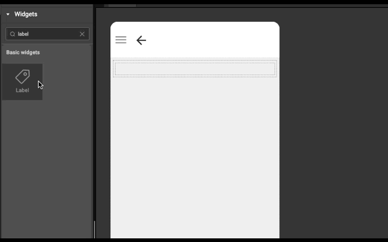
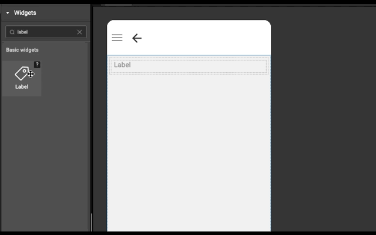
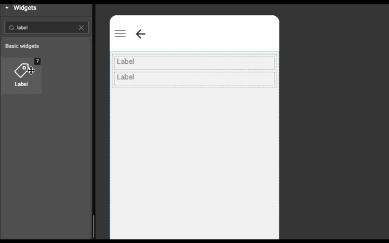
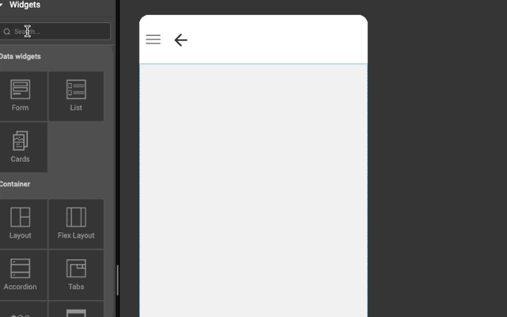

As the name suggests, **Layout** widget is used to build scaffold to hold widgets. Underlyingly, this widget uses wm-linearlayout and wm-linearlayoutitem components. Let us understand these components first.

:::warning
Layout and Flex Layout are available only for React Native apps. Cordova and Web apps will be supported in future.
:::

## Components

**wm-linearlayout** is a container that can only hold **wm-linearlayoutitem** as children. Following [flex-box](https://developer.mozilla.org/en-US/docs/Web/CSS/CSS_Flexible_Box_Layout/Basic_Concepts_of_Flexbox) model, wm-linearlayout arranges its children based on direction property. 

Using horizontal and vertical alignment properties, children can be aligned w.r.t wm-linearlayout. 

Space between two subsequent children can be configured using Spacing property on wm-linearlayout. If a wm-linearlayout does not have spacing property and is inside another wm-linearlayout, then spacing property is inherited from parent.

Linear Layout allocates space to its children in the following way.
1. Space sufficient for each indivicual child is allocated.
2. If there is any remaining space available, remaining space is allocated based upon flex grow property value on each wm-linearlayoutitem.

For example, let's say that there is horizontal linearlayout with three children and width as 600.

- First item requires a width of 50 and has flex property set as 0.
- Second item requires a width of 150 and has flex property set as 2.
- Third item requires a width of 100 and has flex property set as 1.

Total space remaining is 300 (600 - 50 - 150 - 100).

Total flex value is 3 (0 + 2 + 1).

Space is allocated as follows
| | Item 1 | Item 2 | Item3 |
|--|-------|--------|-------|
| factor =   (individual flex / total flex)| 0 / 3 | 2 / 3 | 1 / 3|
| Allocated Space =  (Total Remaining Space * factor) | 300 * (0/3) = 0 |  300 * (2/3) = 200 |  300 * (1/3) = 100| 

:::note
If there is no sufficient space for all children, then shrinkage happens. But, flex shrink is not supported now.
:::

## Layout Construction
When a Layout widget is dragged and dropped into studio canvas, a wm-linearlayout with a single wm-linearlayoutitem child are added to the markup. Further Layout construction can be done in two ways. In the first way, layout is going to be explicity built and widgets have to be dropped inside. In the second way, layout gets auto generated based on the drop position of a widget. 

### Explicit
When a wm-linearlayout is selected, plus and minus buttons are shown. Using these buttons, wm-linearlayoutitem can be added or removed. By clicking on plus button, a child can be added at the end. By clicking on minus button, the last child can be removed.

If direction is horizontal, buttons are shown at right.

If direction is vertical, buttons are shown at bottom.

If wm-linearlayout has a single child, then add button is show at both bottom and right side. When a child is added, then the direction is automatically set based on the button clicked.

Similarly, when a wm-linearlayoutitem is selected, plus buttons are shown at both right and bottom. 
1. Let us take child item of a horizontal layout. 

    If a right plus button is clicked, a wm-linearlayoutitem is added to the same parent. 

    If bottom plus button is clicked on a wm-linearlayoutitem (say item1), then a new wm-linearlayout (say layout2) with 2 items and direction as vertical, is added. All the content of item1 is moved to the first child of layout2. Then, layout2 is added into item1.

2. Let us take child item of a vertical layout.
    

    If a bottom plus button is clicked, a wm-linearlayoutitem is added to the same parent. 

    If right plus button is clicked on a wm-linearlayoutitem (say item1), then a new wm-linearlayout (say layout2) with 2 items and direction as horizontal, is added. All the content of item1 is moved to the first child of layout2. Then, layout2 is added into item1.

:::note

Using the insert button in properties panel, wm-linearlayoutitem can also be added.
:::

### Auto

Layout is generated automatically whenever a widget is dropped into a wm-linearlayoutitem. It works based on the point of drop.

1. If widget is dropped anywhere in an empty wm-linearlayoutitem (item), then widget is added in the item only.

2. If widget is dropped in the **left** half of wm-linearlayoutitem (item), then a wm-linearlayoutitem is added to the **bottom** of the item and widget is added in the newly created item.

3. If widget is dropped in the **right** half of wm-linearlayoutitem (item), then a wm-linearlayoutitem is added to the **right** of the item and widget is added in the newly created item.

## Example
Below is an example to show how easy it is to construct layout automatically. Try this example (both explicit and auto) in WaveMaker Studio to get better understanding.

:::note
In the last before step, flex grow property is set to zero on the wm-linearlayoutitem that has the picture.
:::