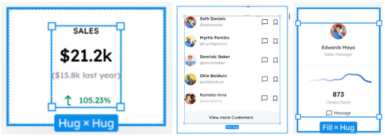
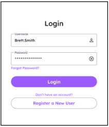

# Design Best Practices

Follow these best practices to ensure optimal output when using our plugin to convert Figma designs into frontend code.

1.  **Frame Naming:** Avoid naming frames with numbers or special characters at the beginning. These names are used for CSS classes and ids, and CSS naming rules must be followed. For example, start frame names with letters, use hyphen `-` or underscore `_` for spaces, etc. [Learn more about CSS naming conventions](https://medium.com/free-code-camp/css-naming-conventions-that-will-save-you-hours-of-debugging-35cea737d849)

2.  **Avoid Wrap Property in Auto Layout:** Refrain from using the wrap property in Figma's Auto Layout. While supported, it can result in inconsistent and inaccurate sizing.

3.  **Images as Fills:** Do not turn images into components. Instead, keep images as fills inside frames.

4.  **Vectors for Icons Only:** Use vectors exclusively for icons and avoid using them for other design elements.

5.  **Instance Properties:** Ensure all properties in instances are within the tree structure and not at the top level. For example, place image properties directly within the appropriate layer.
    
    
6.  **Logos:** Use images or SVGs for logos. Include the word “logo” in the name. If logos are components, ensure the component name also contains “logo.”

7.  **Proper Use of Auto Layout:** Use Auto Layout as intended. below are some of the suggestions on using autolayout.

    -   Parent frame with variable width (Hug)

        -   Immediate children elements must have fixed width.
        -   Spacing should be Auto.

    -   If the parent frame has only one child frame, set the child frame’s layout to either center-center or top-center. This ensures proper alignment and structure.
        

    -   When the child element needs to match the width of a parent frame with variable width (Hug), set the child element’s width to Fill. Example: In an one column form, text fields, buttons, and frames containing text should have their width set to Fill. Fixed widths are treated as fixed sizes and will not adjust to different screen sizes.
        

    -   Case when spacing should be set to `Auto`
        -   For nav bars, subheadings with three-dot menus, etc., where the frame width is variable (Hug), spacing or gap should be set to Auto.
        -   the space between text and an icon should be set to Auto to prevent layout issues, such as single-line text rendering in two lines.
            

8.  **Avoid Unnecessary Children:** Minimize unnecessary nested frames or groups. For example: Instead of adding a rectangle inside a group for background color, directly apply the color to the group itself. As a rule of thumb, if you're creating a unit solely to add a single property, try applying that property to the parent element instead.

9.  **Color Management:** Use colors from local variables or local styles. Do not apply random colors without first defining them in local variables or styles.

10. **Figma API Issue with Hidden Elements:** If a vector, image, or logo exceeds the defined page bounds, Figma may fail to export the “hidden” element as an SVG. To resolve this, increase the page height in Figma to include the element.

By adhering to these guidelines, you can create designs that are clean, maintainable, and ready for seamless conversion to code.
