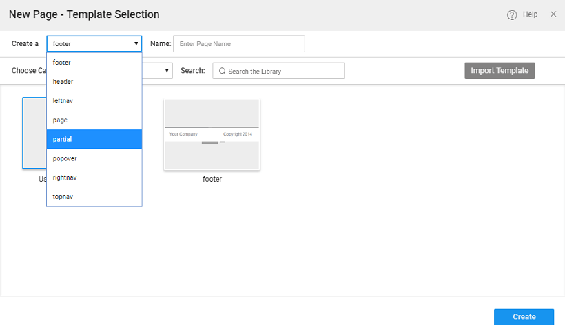

A part of the page which is common across the app like a header or a left navigation can be implemented as a single partial and used across all app pages. These partial pages have to be associated with a component within a page. Here we will be seeing where partial pages can be used, how to create the same and the various types of partial pages available.

partial pages are loaded asynchronously on the page. Partial pages are loaded on-demand when the content is required to be rendered. For example, if the tabs are loading partial content, then the partial content will be loaded only on the visible tab.

are useful for the following reasons:

- selecting a template which is designed for a particular purpose. For example, header template can be used for header type of partial.
- allowing us to select a partial for a component/widget. For example, a left panel can include only partial of type leftnav.
- styling the components specific to the context. For example, links in the left panel should look different from the ones in the right panel.

Partial Pages are created like Pages and can be designed similar to any other Page.

# of Partials

Partials can be further sub-categorised as:

- comes without any layout;
- which can be used to include logo, app name, search bar;
- which can be used for navigation purpose to be placed at the top of the page, below header;
-  which can be used for navigation purpose to be placed on the left of the page;
-  which can be used for navigation purpose to be placed on the right of the page;
- to have the copyright and other information at the bottom of page;
- to be used to display notifications on click of an anchor widget.
- Hybrid Mobile, the available options are - partial or default, leftnav and popover.

We have seen how common parts of pages can be developed using Partial pages. Learn how [layouts](/learn/app-development/ui-design/page-concepts/page-layouts/) help associate these with a component within the pages.

< Page Creation

Basics >

 2. Design UI

- 2.1 Overview
    - [App UI Design](/learn/app-development/ui-design/design-overview/#app-ui-design)
    - [Responsive Design](/learn/app-development/ui-design/design-overview/#responsive-design)
    - [UI Development](/learn/app-development/ui-design/design-overview/#ui-development)
- [2.2 Page Concepts](/learn/app-development/ui-design/page-concepts/)
    - [Single Page Apps](/learn/app-development/ui-design/page-concepts/)
    - [Page Life Cycle](/learn/app-development/ui-design/page-concepts/#page-lifecycle)
    - [Page Creation](/learn/app-development/ui-design/page-creation/)
    - [Parameter Passing](/learn/app-development/ui-design/page-creation/#page-parameters)
    - [Partial Pages](#)
    - vi. Page Basics
        - [Page Layouts](/learn/app-development/ui-design/page-concepts/page-layouts/#page-layouts)
        - [Page Navigation](/learn/app-development/ui-design/page-concepts/page-layouts/#page-navigation)
        - [Events](/learn/app-development/ui-design/page-concepts/page-layouts/#events)
            - [Event Categorization](/learn/app-development/ui-design/page-concepts/page-layouts/#event-categorization)
            - [Multiple Event Handling](/learn/app-development/ui-design/page-concepts/page-layouts/#multiple-events)
    - [Page Templates](/learn/app-development/ui-design/page-concepts/page-templates/)
        - [ Custom Page Templates](/learn/app-development/ui-design/page-concepts/page-templates/#creating-page-templates)
    - [Use Cases](/learn/app-development/ui-design/use-cases-ui-design/)
- [2.3 Project Shell](/learn/app-development/ui-design/project-shells/)
- 2.4 Page Artefacts
    - [Overview](/learn/app-development/ui-design/page-artefacts/)
    - [Markup](/learn/app-development/ui-design/page-artefacts/#page-markup)
    - [Script](/learn/app-development/ui-design/page-artefacts/#page-script)
    - [Style](/learn/app-development/ui-design/page-artefacts/#page-style)
- 2.5 Themes
    - [Overview](/learn/app-development/ui-design/themes/)
    - [Applying Theme](/learn/app-development/ui-design/themes/#apply-theme)
    - [Importing Theme](/learn/app-development/ui-design/themes/#import-theme)
    - [Creating Themes](/learn/app-development/ui-design/themes/#create-theme)
        - [Creating Web Theme](/learn/app-development/ui-design/themes/#create-theme-web)
        - [Creating Web Theme using Bootswatch](/learn/app-development/ui-design/themes/#create-theme-bootswatch)
        - [Creating Mobile Theme](/learn/app-development/ui-design/themes/#create-theme-mobile)
    - [Building Theme](/learn/app-development/ui-design/themes/#build-theme)
    - [Testing Theme](/learn/app-development/ui-design/themes/#test-theme)
