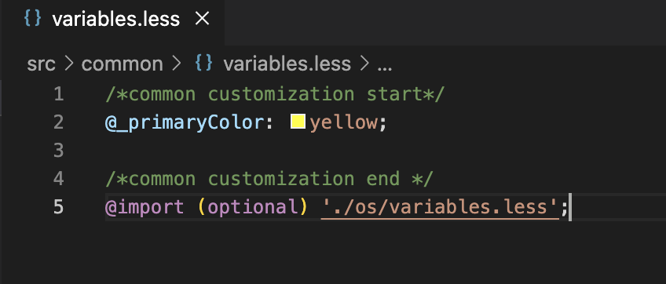

---

React Native apps can be styled using a theme. Common (theme) styles will greatly reduce the styling effort of individual apps. Following topics, related to a theme, are discussed in this article.

1. Create theme
2. Theme Project Structure
3. Customize theme
4. Compile theme
5. Update theme
6. Import theme

## Required software
- Node (14.x)
- npm install -g @wavemaker/rn-codegen 

## 1. Create Theme
- Open a terminal
- Navigate to a directory where theme project has to be created
- Execute following command.
```
wm-rn-codegen theme generate ${theme-name}
```
- A new folder with the given theme name should get created.
- Open **.wmproject.properties** file.
- Provide value to name (required) and other metadata.
- Push the theme project to your VCS (optional).
## 2. Theme Project Structure

Following is the folder structure of a theme project

- **$ThemeProject**
    - **src**
        - **android** - theme customizations specific to Android
        - **ios**  - theme customizations specific to iOS
        - **common** - theme customizations that are common to both Android and iOS
    - **theme.png** - a picture that represents this theme
    - **wavemaker** - This folder contains all the default styles that are provided by WaveMaker React Native framework. Contents of this folder is maintained by WaveMaker platform. Avoid any modifications in this folder.
    - **.wmproject.properties** - information about the theme

## 3. Customize theme
To understand customiztion, let's take button as example.

- Go to $ThemeProject/wavemaker
- For each widget, there is a less file inside wavemaker folder. Copy button.less from **wavemaker/components/basic/button.less** to **src/common/components/basic/button.less**. 
> Path structure should be same in both wavemaker and src/common folders. If customization is needed for a specific platform, then file has to be copied into src/platform_name.
- Open the copied file and change/add styles.

Customizing theme colors is explained below.
- Open WaveMaker/variables.less
- Select the color that requires change.
- Open src/common/variables.less. For platform specific change, open corresponding variables.less of that platform folder.
- If **@platformColor** has to be changed, then add a less variable with name **@_platformColor** and assign the desired value. New variable name must have underscore between @ and variable name. For example, @_primaryColor will override the value of @primaryColor.

## 4. Compile Theme
- Open a terminal
- Navigate to the directory where theme project is.
- Execute following command.
```
wm-rn-codegen theme compile
```
- Under the dist folder, theme.zip file should get created after successful compilation.
## 5. Update Theme Project
- Open a terminal
- Navigate to the directory where theme project is.
- Execute following command.
```
wm-rn-codegen theme update
```
- Theme project (Contents of the wavemaker folder) is migrated.
> Whenever @wavemaker/rn-codegen is updated, run theme update on the existing theme projects.

## 6. Import theme into the project.  
- Zip that generated in the compiled step, can be imported into a React Native project.
- Follow the procedure mentioned at [https://docs.wavemaker.com/learn/app-development/ui-design/themes#import-theme](https://docs.wavemaker.com/learn/app-development/ui-design/themes#import-theme).